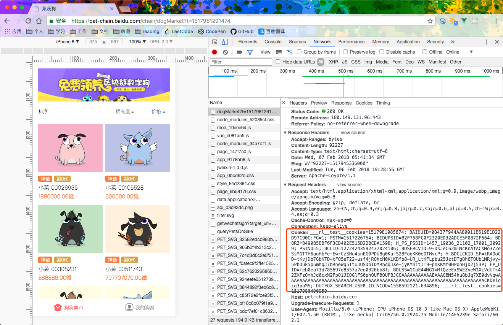

# 莱茨狗

百度莱茨狗抢狗脚本

## 如何使用

1. 安装 Node.js，最好新版本。

2. 克隆仓库 `git clone https://github.com/little-tongue/let-us-go.git`

3. 进入到项目目录并安装依赖

```bash
$ cd let-us-go
$ npm install
```

4. 修改配置文件

配置文件内容如下：

```js
module.exports = {
  cookie: '',
  threshold: [1800, 1900, 1900, 1900, 1900, 1900], // 不同稀有度购买对低价的阈值
  baiduORC: ['', '', '']
};
```

先到百度云应用上开通文字识别[链接](https://console.bce.baidu.com/ai/?fromai=1#/ai/ocr/overview/index)。

将 `cookie` 修改为百度莱茨狗网页的 `cookie`，然后将申请到的 `AppID`、`API Key`、`Secret Key` 依次填入 `baiduORC` 数组中。

5. 启动应用 `npm start`

## 其他

### cookie 如何看

在莱茨狗页面打开浏览器开发者工具，在 `NetWork` 面板中点击任意请求，在请求头中即包含 `cookie` 信息，如下图所示

